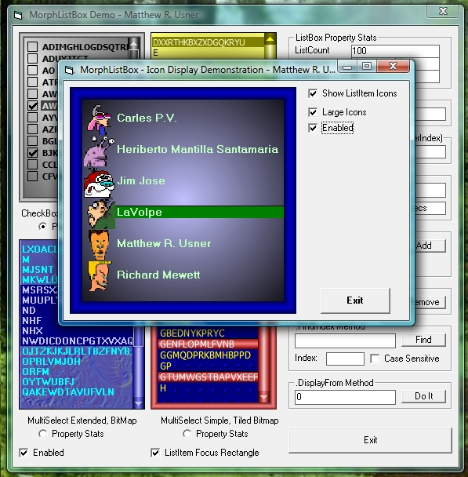



## MorphListBox 1\.21 \- Graphical Listbox UserControl

### Description

(Added .Sort method) A purely graphical replacement/enhancement for the VB single-column listbox control. Standard vertical listbox behavior is consistently emulated, with the exception of a couple intricacies of list item selection in .MultiSelect = Extended mode. Control features an integrated graphical vertical scrollbar. Custom .FindIndex and .MouseOverIndex methods. Background can be a gradient or bitmap. Small bitmaps can be tiled or stretched to fit the display area. Each listitem can have an associated icon displayed next to it. Eight gradient color schemes can be selected via the .Theme property. Unicode display supported. Drag and drop capability incorporated. Numeric list sorting option. .DisplayFrom method allows you to display any part of the list through code. .RightToLeft allows smooth, natural operation for those whose written language goes from right to left. Loads lists several times faster than traditional VB listbox, depending on your system. Due to size of control, this is best used as a compiled .OCX. As always, constructive feedback welcome, votes appreciated.
 
### More Info
 

             |
---                |---
**Submitted On**   |2007-04-04 20:23:58
**By**             |[Option Explicit](https://github.com/Planet-Source-Code/PSCIndex/blob/master/ByAuthor/option-explicit.md)
**Level**          |Intermediate
**User Rating**    |5.0 (280 globes from 56 users)
**Compatibility**  |VB 6\.0
**Category**       |[Custom Controls/ Forms/  Menus](https://github.com/Planet-Source-Code/PSCIndex/blob/master/ByCategory/custom-controls-forms-menus__1-4.md)
**World**          |[Visual Basic](https://github.com/Planet-Source-Code/PSCIndex/blob/master/ByWorld/visual-basic.md)
**Archive File**   |[MorphListB205854442007\.zip](https://github.com/Planet-Source-Code/option-explicit-morphlistbox-1-21-graphical-listbox-usercontrol__1-62733/archive/master.zip)

### API Declarations

Lots and lots.

